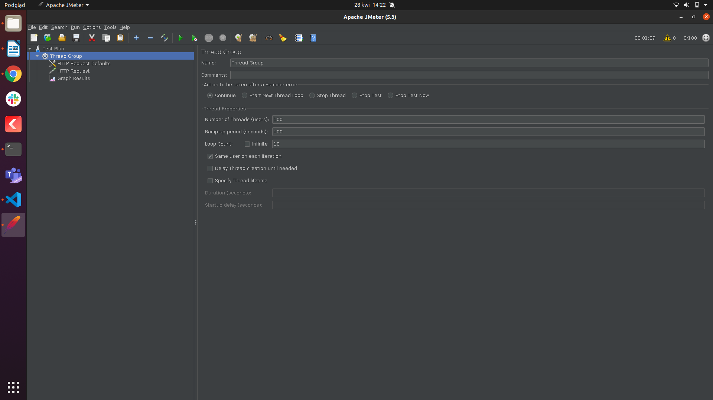
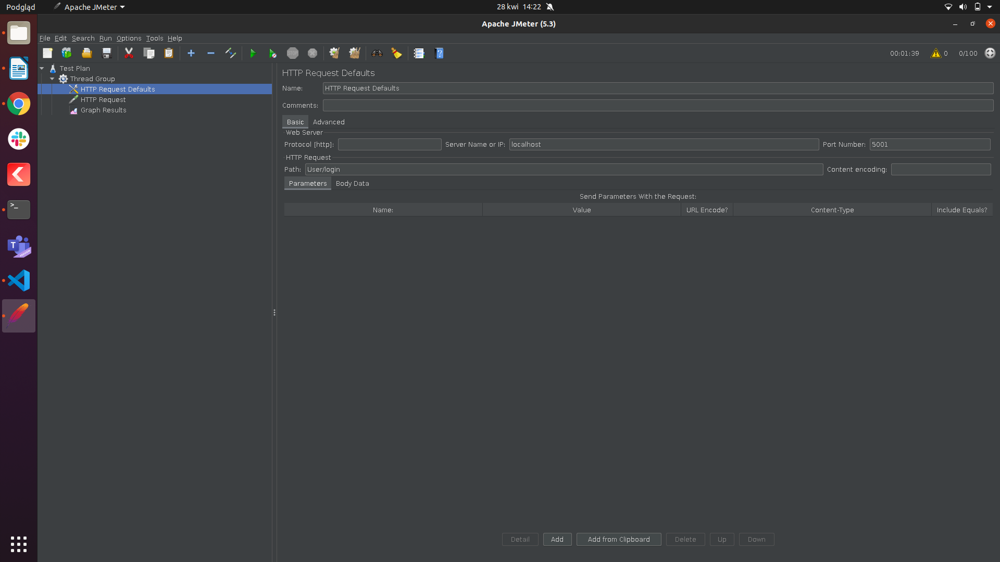
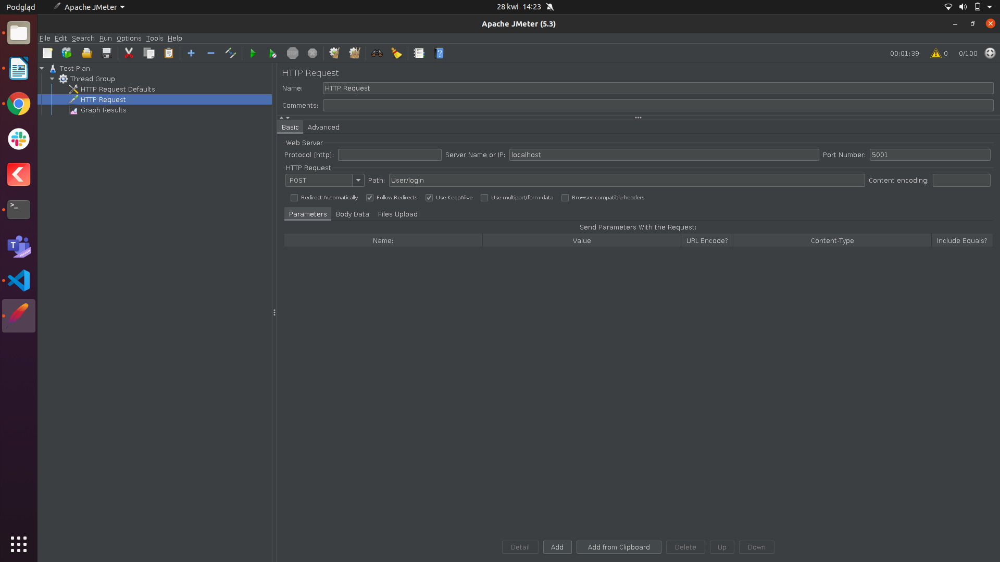
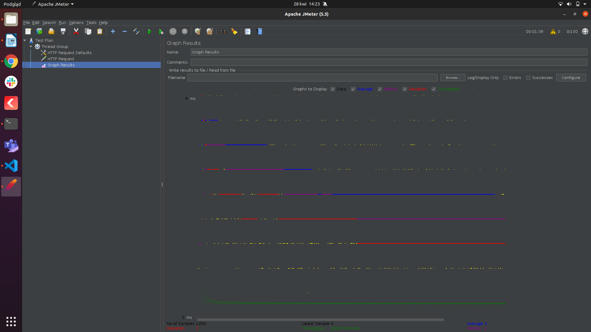

# Test wydajnościowy
Przeprowadzenie prostego testu wydajnościowego w oparciu o protokół HTTP przy użyciu aplikacji JMeter.

- Liczba wątków (użytkowników): liczba użytkowników, która łączy się z docelową stroną internetową.
- Uruchom w ciągu (sekund): liczba czasu do wykonania testu.
- Liczba powtórzeń: czas opóźnienia przed uruchomieniem kolejnego użytkownika. Na przykład, jeśli mamy 100 użytkowników i 100-sekundowy okres rozruchu to opóźnienie między uruchomionymi użytkownikami będzie wynosić 1 sekundę (100 sekund / 100 użytkowników).

